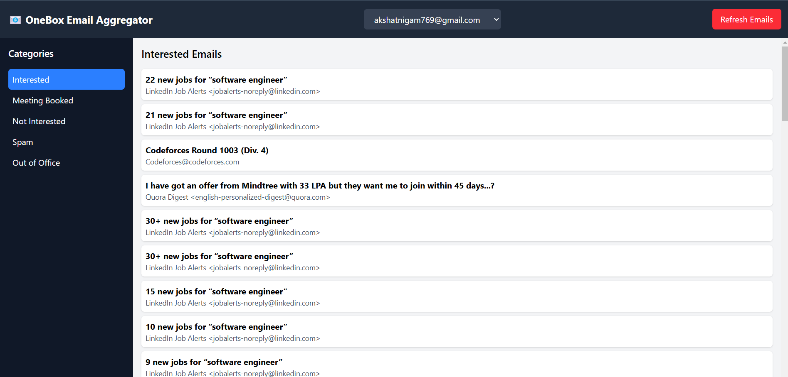

# EmailOneBox

## Overview

EmailOneBox is a feature-rich onebox email aggregator that synchronizes emails in real-time using IMAP, indexes them in Elasticsearch for fast searching, categorizes them using AI, and integrates with Slack and webhooks for notifications. The project includes a frontend built with Vite + React for easy email management.

## Features

- **IMAP Email Synchronization**: Real-time email fetching using IMAP IDLE mode.
- **Elasticsearch Indexing**: Fast and efficient email search.
- **AI-Based Categorization**: Uses Gemini API for intelligent email classification.
- **Slack Notifications**: Sends notifications for 'Interested' emails.
- **Webhook Integration**: Triggers webhooks for automation.
- **Frontend Interface**: Built with Vite + React, allowing email browsing, filtering, and searching.
- **Multiple Categories**: Emails categorized as 'Interested,' 'Meeting Booked,' 'Not Interested,' and 'Out of Office.'

## Technologies Used

- **Backend**: Node.js, Express, MongoDB, IMAP, Elasticsearch
- **Frontend**: React, Vite
- **AI Integration**: Gemini API
- **Notifications**: Slack Webhook
- **Automation**: Webhooks (via webhook.site for testing)

## Installation

### Prerequisites

- Node.js & npm installed
- MongoDB instance running
- Elasticsearch instance running
- IMAP-enabled email account
- Slack Webhook configured

### Backend Setup

1. Clone the repository:
   ```sh
   git clone https://github.com/Akshat1813/emailOneBox.git
   cd emailOneBox/backend
   ```
2. Install dependencies:
   ```sh
   npm install
   ```
3. Set up environment variables in a `.env` file:
   ```env
   MONGO_URI=your_mongo_uri
   IMAP_HOST=your_imap_host
   IMAP_USER=your_email@example.com
   IMAP_PASSWORD=your_email_password
   ELASTICSEARCH_URL=your_elasticsearch_url
   SLACK_WEBHOOK_URL=your_slack_webhook
   WEBHOOK_URL=your_webhook_url
   ```
4. Start the server:
   ```sh
   npm start
   ```

### Frontend Setup

1. Navigate to the frontend directory:
   ```sh
   cd ../frontend
   ```
2. Install dependencies:
   ```sh
   npm install
   ```
3. Start the frontend:
   ```sh
   npm run dev
   ```
4. Access the frontend at: [EmailOneBox](https://email-one-box.vercel.app/)

## Usage

- Access the frontend at `https://email-one-box.vercel.app/`
- View, search, and categorize emails
- Notifications are sent to Slack for 'Interested' emails
- Webhooks trigger automation when an email is marked as 'Interested'

## Screenshots

### Dashboard View

### Email Content

## Future Enhancements

- Support for multiple email accounts
- OAuth authentication for email providers
- More AI-based email insights
- Enhanced UI/UX
